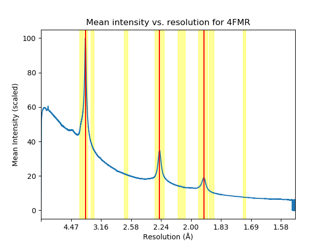

.. iolite documentation master file, created by
   sphinx-quickstart on Fri Jun 28 16:23:36 2019.
   You can adapt this file completely to your liking, but it should at least
   contain the root `toctree` directive.

iolite
==================================
This software package can be used to classify X-ray diffraction datasets of macro-molecular crystallography
with regards to the existence of ice-rings, overlapping spots and mosaicity.

.. toctree::
   :maxdepth: 2
   :caption: Contents:

Installation
------------

To install from source, clone the `GitHub <https://github.com/egrahl/iolite/>`_ repository and then do the following:

.. code-block:: bash

    python setup.py install

Testing
-------

To run the tests, download the source code and do the following:

.. code-block:: bash

    python setup.py test

How to use
==========

iolite can either process multiple datasets of a given directory at once, but its modules can also be run individually on one dataset.
However, at the current stage, it can only succesfully run if the given image data is from one sweep.

Running multiple datasets at once
---------------------------------
In order to run iolite for multiple datasets, one should create a new directory, in which the processing results of iolite will be saved:

.. code-block:: bash

    mkdir NEW_DIRECTORY
    cd NEW_DIRECTORY

From this directory one can run iolite_preparation with up to 2 input directories that contain the raw datasets:

.. code-block:: bash

    iolite_preparation --input1=/PATH/TO/FIRST/INPUT/DIRECTORY --input2=/PATH/TO/SECOND/INPUT/DIRECTORY

iolite_preparation will run all necessary modules for each dataset in the input directories so that they can then be classified.
The classification of the datasets can be done by running label_dataset:

.. code-block:: bash

    label_dataset 

This will result in the creation of the following text files in the working directory:

    * table_ice_ring_classification.txt
    * table_overlap_pixel_classification.txt
    * table_overlap_reflection_classification.txt
    * table_sigma_classification.txt

Each table will consist of a column for the PDB id of the dataset. The other columns are the following:

    * table_ice_ring_classification.txt:
        * **Ice-rings** : *y* (ice-rings are present) or *n* (no ice-rings present) 
        * **No. ice-rings** : number of found ice-rings
        * **Strength** : *strong* or *weak*
        * **Sharpness** : *sharp* or *diffuse*

    * table_overlap_pixel_classification.txt:
        * **total(pixel)** : label of total overlap per pixel (*low*, *medium* or *high*)
        * **Rank total(pixel)** : percentile rank of total overlap in reference distribution
        * **fg(pixel)** : label of foreground overlap per pixel (*low*, *medium* or *high*)
        * **Rank fg(pixel)** : percentile rank of foreground overlap in reference distribution
        * **bg(pixel)** : label of background overlap per pixel (*low*, *medium* or *high*)
        * **Rank bg(pixel)** : percentile rank of background overlap in reference distribution
        * **bg/fg(pixel)** : label of background/foreground overlap per pixel (*low*, *medium* or *high*)
        * **Rank bg/fg(pixel)** : percentile rank of background/foreground overlap in reference distribution        

    * table_overlap_reflection_classification.txt:
        * **total(refl.)** : label of total overlap per reflection (*low*, *medium* or *high*)
        * **Rank total(refl.)** : percentile rank of total overlap in reference distribution
        * **fg(refl.)** : label of foreground overlap per reflection (*low*, *medium* or *high*)
        * **Rank fg(refl.)** : percentile rank of foreground overlap in reference distribution
        * **bg(refl.)** : label of background overlap per reflection (*low*, *medium* or *high*)
        * **Rank bg(refl.)** : percentile rank of background overlap in reference distribution
        * **bg/fg(refl.)** : label of background/foreground overlap per reflection (*low*, *medium* or *high*)
        * **Rank bg/fg(refl.)** : percentile rank of background/foreground overlap in reference distribution      

    * table_sigma_classification.txt:
        * **sigma b** : label of sigma b (*low*, *medium* or *high*)
        * **Rank sigma b** : percentile rank of the sigma b value in reference distribution
        * **sigma m** : label of sigma m (*low*, *medium* or *high*)
        * **Rank sigma m** : percentile rank of the sigma m value in reference distribution

Additionally, in every directory of the datasets there will be text files created containing the labels for the 
dataset. The names of the text files are the following:
    * label_ice_rings.txt
    * label_overlap_pixel.txt
    * label_overlap_shoebox.txt
    * label_sigma.txt

Processing of one dataset
-------------------------

The program requires dials. Therefore, one should run:

.. code-block:: bash

    module load dials/latest

Now one can run the preparation modules in a directory that will contain the output data.

Ice-rings
^^^^^^^^^
In order to classify a dataset whether it has ice-rings or not, the data needs to be imported from the source directory with dials. 

.. code-block:: bash

    dials.import /PATH/TO/IMAGES/*

This should write an output file *imported.expt*. The next step is to find the strong spots on the images, for that run:

.. code-block:: bash
    dials.find_spots integrated.expt nproc=4

This will write a file *strong.refl* into your working directory and will contain the reflection table.

With that you can now run radial_average_bg.py. 

.. warning::
    The program can only run successfully if you use dials.python!

.. code-block:: bash

    dials.python /PATH/TO/IOLTE/iolite/src/iolite/ice_ring/radial_average_bg.py imported.expt

The documenation of *radial_average_bg* can be found here:

*radial_average_bg* will write an outputfile called table.txt, which contains the resolution data in the first column and the 
intensity data in the second.
One can now run *ice-rings*, which writes an output file *label_ice_rings.txt* that contains the labels already described in `Running multiple datasets at once`_

Overlapping spots
^^^^^^^^^^^^^^^^^
*overlapping_spots* requires preprocessing with xia2. For that type:

.. code-block:: bash

    xia2 image=/PATH/TO/FIRST/IMAGE:1:[number of images of the first sweep] dials.integrate.phil_file=/dls/science/users/gwx73773/iolite/share/integrate_params.phil

Once the processing with xia2 was successful, it should be possible to change to the directory */DEFAULT/NATIVE/SWEEP1/integrate*. In there one should find the files
*13_integrated.expt* and *13_integrated.pickle*
These files are the input files for *extract*. To run *extract* type:

.. code-block:: bash

    dials.python /PATH/TO/IOLTE/iolite/src/iolite/overlaps/extract.py 13_integrated.expt 13_integrated.refl

*extract* should write one pickle file per image, containing the reflection table of each image, e.g. *shoeboxes_0.pickle*
Now one can run *overlapping_spots*. *overlapping_spots* has to modes it can run in: 

1. **overlaps per pixel**
    The program can calculate the ratios of overlaps per pixel for the whole dataset and for resolution bins.
    It needs to be run with dials.python:

    .. code-block:: bash

        dials.python /PATH/TO/IOLITE/iolite/src/iolite/overlaps/overlapping spots.py --run_pixel

    This will write two output files: 
        1. **overlap_total_pixel.txt**
            This file contains the total overlap ratio, the foreground overlap ratio, the background overlap ratio and the background/foreground overlap ratio
        2. **overlap_lists_pixel.txt**
            This file contains the columns (in order):
            * average resolution of resolution bin
            * total overlap ratio of resolution bin
            * foreground overlap ratio of resolution bin
            * background overlap ratio of resolution bin
            * foreground/background overlap ratio of resolution bin

2. **overlaps per reflection**
    The program can calculate the ratios of overlaps per reflection for the whole dataset and for resolution bins.
    It needs to be run with dials.python:

    .. code-block:: bash

        dials.python /PATH/TO/IOLITE/iolite/src/iolite/overlaps/overlapping spots.py 

    This will write two output files:
    1. **overlap_total_shoebox.txt**
            This file contains the total overlap ratio, the foreground overlap ratio, the background overlap ratio and the background/foreground overlap ratio
    2. **overlap_lists_shoebox.txt**
        This file contains the columns (in order):
        * average resolution of resolution bin
        * total overlap (considering foreground/background overlap) ratio of resolution bin
        * total overlap (considering background/foreground overlap) ratio of resolution bin
        * foreground overlap ratio of resolution bin
        * background overlap ratio of resolution bin
        * foreground/background overlap ratio of resolution bin
        * background/foreground overlap ratio of resolution bin

Labelling of the dataset
^^^^^^^^^^^^^^^^^^^^^^^^
The label file for the ice-rings has already been written if you ran *ice_rings*.
In order to get the label files for the overlaps and the sigma values run the following in the highest level of the directory of your dataset:

.. code-block:: bash

    label_dataset

This will write the following files:
    * label_ice_rings.txt
    * label_overlap_pixel.txt
    * label_overlap_shoebox.txt
    * label_sigma.txt

The contents of these files are described in `Running multiple datasets at once`_.

If one wants to only get the label file for one of the possible classifications, one can run the folowing programs:

    1. **Label for overlaps per pixel**

        .. code-block:: bash

            classify_overlaps --pixel_count

    2. **Label for overlaps per reflection**

        .. code-block:: bash

            classify_overlaps

    3. **Label for sigma values**

        .. code-block:: bash

            classify_sigma

Plotting of results
-------------------
It is possible to plot the results of some modules.

Plots from ice_ring
^^^^^^^^^^^^^^^^^^^
1. **radial_average_bg** 
    It is possible to plot the average intensities of the pixels with the following line:

    .. code-block:: bash

        dials.python /PATH/TO/IOLTE/iolite/src/iolite/ice_ring/radial_average_bg.py imported.expt plot=True

2. **ice_rings**
    It is possible to plot the mean intensity against the resolution data with the following line:

    .. code-block:: bash

        ice_rings --showPlot

    If the algorithm has detected a peak, it will be marked with a vertical red line. The resolution ranges at which ice-rings are common are shown as yellow bars.

API documentation
-----------------

Please check out the API documentation :doc:`here <modules/>`.

Issues
------

Please use the `GitHub issue tracker
<https://github.com/egrahl/iolite/issues/>`_ to submit bugs or request
features.

License
-------

Copyright Elin Grahlert, 2019.

.. literalinclude:: ../LICENSE
   :language: text
   
Indices and tables
==================

* :ref:`genindex`
* :ref:`modindex`
* :ref:`search`

